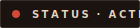
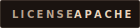
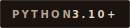
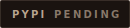
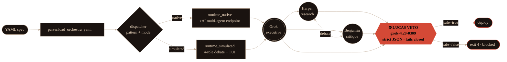

<div align="center">

<picture>
  <source media="(prefers-color-scheme: dark)" srcset=".github/assets/hero-dark.png">
  <source media="(prefers-color-scheme: light)" srcset=".github/assets/hero-light.png">
  
</picture>

<br>

<picture>
  <source media="(prefers-color-scheme: dark)" srcset=".github/assets/badges/status-active-dark.svg">
  
</picture>





<br><br>

<em>YAML → four-agent debate → Lucas veto → deploy.</em><br>
<em>If Lucas says no, nothing ships. That's the entire product.</em>

</div>

<br>


## What this is

Grok Agent Orchestra turns one YAML file into a **Grok 4.20 multi-agent run** with a mandatory safety veto at the exit. Four named roles — Grok (executive), Harper (research), Benjamin (critique), and Lucas (veto) — debate, and Lucas has the final word. Every deploy, every post, every webhook call passes through a fail-closed JSON gate running on `grok-4.20-0309`. Veto → exit code 4. No deploy.

Two execution modes from the same spec: **native** (xAI's `grok-4.20-multi-agent-0309` endpoint, 4 or 16 agents) or **simulated** (visible per-role debate, streamed through a Rich live TUI you can actually watch).

## Why you'd use it

- You're shipping Grok-powered output to a public surface (X, webhooks, user-facing endpoints) and "the model said it was fine" isn't a safety review.
- You want **auditable** multi-agent debate — not a black-box ensemble, but four named roles you can read the transcripts of.
- You need the gate to **fail closed**: malformed veto response, low confidence, timeout → the post doesn't go out.


## 30 seconds to a dry run

```bash
pip install grok-agent-orchestra   # pending — use `pip install -e .` from source for now
grok-orchestra init orchestra-native-4 --out my-spec.yaml
grok-orchestra run my-spec.yaml --dry-run
```

No xAI tokens needed for `--dry-run`. Canned-stream replay clients keyed on prompt shape make every pattern previewable offline.


## Architecture



Five orchestration patterns compose on top: `hierarchical`, `dynamic-spawn`, `debate-loop`, `parallel-tools`, `recovery`. Each ≤120 LOC. Each ends at Lucas.

## The Lucas veto

The thing that makes Orchestra different from every other agent framework.

- Runs on `grok-4.20-0309` with **high reasoning effort**
- Enforces **strict JSON output** via schema + regex fallback parser
- **Fails closed** on malformed output, low confidence, or timeout
- Two separate veto passes in the combined runtime (one mid-debate, one pre-deploy)
- Exit codes: `0` success · `2` CLI error · `3` parse fail · `4` **veto** · `5` runtime fail
- Rich panel output: green ✅ for safe, red ⛔ for blocked

```yaml
# my-spec.yaml — minimal native run with veto
mode: native
pattern: hierarchical
model: grok-4.20-multi-agent-0309
agents: 4
task: "Draft a technical thread on the ΔS-1 migration."
veto:
  model: grok-4.20-0309
  effort: high
  fail_closed: true
```


## CLI

Eight commands, all Typer, all with typed exit codes.

| Command | Purpose |
|---|---|
| `init <template>` | Scaffold a YAML spec from 10 certified templates |
| `run <spec>` | Execute orchestra (supports `--dry-run`) |
| `validate <spec>` | Schema-check without executing |
| `patterns` | List available orchestration patterns |
| `templates` | List available templates with descriptions |
| `veto <text>` | Run Lucas veto standalone on arbitrary text |
| `combined <spec>` | Bridge codegen → Orchestra debate → veto → deploy in one Live panel |
| `doctor` | Environment / API key / model access check |

## Patterns

- **Hierarchical** — executive (Grok) delegates to research (Harper) and critique (Benjamin); synthesis before veto
- **Dynamic-spawn** — `asyncio.gather` fan-out across N agents; veto aggregates
- **Debate-loop** — iterate Harper ↔ Benjamin with mid-loop veto and consensus check
- **Parallel-tools** — union tool allowlist with post-stream audit before veto
- **Recovery** — rate-limit / timeout wrapper with `fallback_model`; veto runs on final output only

## VS Code integration

Draft-07 JSON Schema with `markdownDescription` on every field, 10 YAML snippets, glob-bound to `*.orchestra.yaml` and `*.combined.yaml`. Install the extension → autocompletion, inline docs, validation-as-you-type.


## Install from source

```bash
git clone https://github.com/agentmindcloud/grok-agent-orchestra.git
cd grok-agent-orchestra
pip install -e ".[dev]"
grok-orchestra doctor
```

Requires Python 3.10 / 3.11 / 3.12. CI matrix covers all three with ≥85% coverage enforcement.

## Sibling tools

Part of the AgentMindCloud family:

- **[grok-build-bridge](https://github.com/agentmindcloud/grok-build-bridge)** — codegen layer. Orchestra + Bridge compose via `grok-orchestra combined`.
- **[grok-install](https://github.com/agentmindcloud/grok-install)** — the declarative spawn manifest standard.
- **[universal-spawn](https://github.com/agentmindcloud/universal-spawn)** — cross-platform spawn standard.

## License

Apache 2.0. Use it, fork it, ship it. Lucas still has to sign off.

<br>

<div align="center">

<br>
<em>Residual Frequencies · Plate N° 08 · Observational study, multi-agent orchestration under safety veto.</em>
</div>


