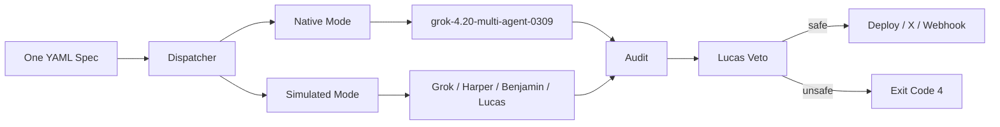

# Grok Agent Orchestra


## The auditable Grok 4.20 multi-agent layer with a mandatory Lucas veto before deploy

**Grok Agent Orchestra** turns a single YAML spec into either the xAI-native `grok-4.20-multi-agent-0309` flow or a visible four-role simulated debate.  
Every orchestration pattern ends with the same hard rule: a strict-JSON **Lucas veto** on `grok-4.20-0309` that fails closed and can block deploy or X-posting with **exit code 4**.

---

## Why this repo matters

| Problem | What Orchestra does |
|---|---|
| Multi-agent systems are hard to audit | Makes debate visible through named roles and a Rich live TUI |
| Safety checks are often optional | Runs a mandatory Lucas veto on every pattern before deploy |
| Previewing orchestration usually burns tokens | Supports full `--dry-run` replay with canned-stream clients |
| Multi-stage pipelines often feel fragmented | Chains parse → Bridge → debate → veto → deploy in one continuous Live panel |

---

## Architecture at a glance



---

## What you get

- **Mandatory Lucas veto** with strict JSON output, malformed-response retries, regex fallback parsing, and fail-closed behavior.
- **Two execution modes from one YAML**: `native` for xAI multi-agent and `simulated` for visible named-role debate.
- **Five composable orchestration patterns**: hierarchical, dynamic-spawn, debate-loop, parallel-tools, recovery.
- **Rich live DebateTUI** with a re-entrant layout that keeps the entire run inside one continuous panel.
- **Ten certified templates** plus machine-readable `INDEX.yaml`.
- **VS Code support** via Draft-07 schema, markdown descriptions, and YAML snippets.

---

## Fastest demo

```bash
grok-orchestra init orchestra-native-4 --out my-spec.yaml && grok-orchestra run my-spec.yaml --dry-run
```

---

## Modes

| Mode | What it does | Best when |
|---|---|---|
| `native` | Uses the xAI multi-agent endpoint directly | You want xAI-native coordination with 4 or 16 agents |
| `simulated` | Runs a visible four-role debate | You want auditability, role visibility, and tool-routing clarity |

---

## Patterns

| Pattern | Purpose |
|---|---|
| `hierarchical` | Research → critique → synthesis |
| `dynamic-spawn` | Async fan-out with `asyncio.gather` |
| `debate-loop` | Iterative debate with mid-loop veto |
| `parallel-tools` | Tool union + post-stream audit |
| `recovery` | Timeout/rate-limit fallback handling |

---

## The technical detail serious builders will notice

The standout implementation is the **combined runtime**: a re-entrant Rich `Live` TUI that streams multiple phases in one uninterrupted panel, supports non-TTY structured logs, runs dual safety gates, and still provides a full `--dry-run` path without making an xAI call.

---

## Status

- **Version:** 0.1.0  
- **License:** Apache-2.0  
- **Cadence:** 17 commits in the last 30 days  
- **Audience:** Python teams shipping Grok-powered agents to public endpoints that need auditable debate and a hard safety gate before anything goes live

