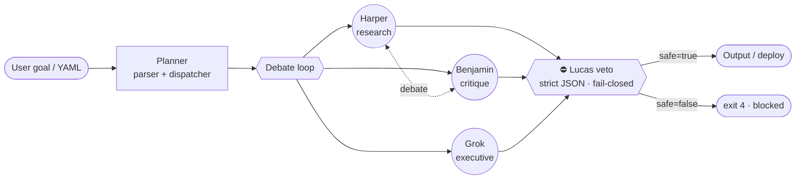

<h1 align="center">Grok Agent Orchestra</h1>

<p align="center">
  <b>Multi-agent research with visible debate and enforceable safety vetoes — powered by Grok.</b>
</p>

<p align="center">
  <a href="https://pypi.org/project/grok-agent-orchestra/"></a>
  <a href="https://www.python.org/downloads/"></a>
  <a href="LICENSE"></a>
  <a href="#"></a>
  <a href="#"></a>
  <a href="https://github.com/agentmindcloud/grok-agent-orchestra/stargazers"></a>
</p>

<p align="center">
  
</p>

---

## Why Agent Orchestra?

- **Visible debate, not a black box.** Four named roles (Grok, Harper, Benjamin, Lucas) argue on screen. Every turn, every tool call, every reasoning gauge streams into a Rich TUI you can actually read while it happens.
- **Lucas veto = enforceable quality / safety gate.** A separate `grok-4.20-0309` pass with strict-JSON output, high reasoning effort, and *fail-closed* defaults. Malformed, low-confidence, or timed-out → exit code 4 → nothing ships.
- **Native Grok multi-agent endpoint as power mode.** Today: drive `grok-4.20-multi-agent-0309` directly (4 or 16 agents) *or* run a prompt-simulated debate from the same YAML. Bring your own key from any provider via the LiteLLM adapter — same orchestration, your choice of engine.

> **Multi-agent research that runs free on your laptop OR scales up with your favorite cloud LLM.**

## Three-tier capability matrix

Pick the tier that matches what you have on hand right now. `grok-orchestra doctor` will tell you which tiers your machine has configured.

| Tier | Setup | Cost | Quality | Best for |
| --- | --- | --- | --- | --- |
| **Demo mode** | None — works on a fresh `pip install` | $0 | Pre-canned, deterministic | First five minutes; demos; the README hero GIF |
| **Local mode** (Ollama) | `ollama pull llama3.1:8b` + `pip install 'grok-agent-orchestra[adapters]'` | $0 | Solid for drafts; below cloud frontier | Privacy-sensitive runs; offline laptops; CI without keys |
| **Cloud mode** (BYOK) | Set `XAI_API_KEY` / `OPENAI_API_KEY` / `ANTHROPIC_API_KEY` | Pay-as-you-go (your invoice) | Ship-grade | Production research, customer-facing reports |

Capabilities by tier:

| Capability | Demo | Local | Cloud |
| --- | :---: | :---: | :---: |
| Visible 4-role debate (Grok / Harper / Benjamin / Lucas) | ✅ canned | ✅ real | ✅ real |
| Live debate streaming in the TUI / web UI | ✅ | ✅ | ✅ |
| Lucas veto (fail-closed safety gate) | ✅ canned verdicts | ✅ runs on local LLM | ✅ runs on Grok / Claude |
| Per-role model overrides (`agents[].model`) | n/a | ✅ Ollama pins | ✅ any provider |
| Live web research via Tavily | n/a | 🟡 BYOK Tavily key | ✅ |
| Native Grok multi-agent endpoint (one streamed call) | n/a | n/a | ✅ Grok-only runs |
| Citations + Markdown / PDF / DOCX export | ✅ | ✅ | ✅ |

Honest tradeoffs:

- **Demo mode** uses pre-canned event streams. It's the right path to learn the framework's vocabulary in five minutes, but it won't answer real research questions — every run produces the same canned text shape.
- **Local mode** swaps in a real LLM, but `llama3.1:8b` is materially below `claude-3-5-sonnet` / `grok-4.20` on long-context synthesis. The visible debate + Lucas veto still keep failure modes loud — the *reasoning quality* tracks the model.
- **Cloud mode** is the production path. Mixing a cloud-grade Lucas with a local Harper is a pragmatic middle ground (`mode_label="mixed"` in the run summary).

Run `grok-orchestra doctor` to see which tiers your laptop has live right now.

## Compared to GPT-Researcher

[gpt-researcher](https://github.com/assafelovic/gpt-researcher) is the reference competitor. Honest scorecard:

| Capability | Grok Agent Orchestra | GPT-Researcher |
| --- | --- | --- |
| Multi-agent debate | ✅ Visible & streamed | ❌ Hidden |
| Safety veto layer | ✅ Lucas (fail-closed) | ❌ |
| Native Grok multi-agent endpoint | ✅ | ❌ |
| Runs free on your laptop (Ollama, no keys) | ✅ Documented + smoke-tested | 🟡 Possible, not surfaced |
| Local docs ingest | 🟡 Roadmap | ✅ |
| Web UI | ✅ Live debate stream | ✅ |
| Live web research | ✅ Tavily + cited findings | ✅ |
| `pip install` from PyPI | ✅ from v0.1.0 | ✅ |
| Multi-arch Docker image | ✅ amd64 + arm64 on `ghcr.io` | 🟡 |
| Pluggable LLMs (BYOK) | ✅ Grok native + LiteLLM adapter | ✅ |

🟡 = on the roadmap, see [Roadmap](#roadmap). We won't claim a checkmark we can't back.

## Quickstart

Pick the install path that fits your situation. They produce the same `grok-orchestra` CLI.

### From PyPI

```bash
pip install grok-agent-orchestra
```

Available from `v0.1.0` onward.

### From GitHub

If you need a tip-of-`main` build before the next release. The sibling [`grok-build-bridge`](https://github.com/agentmindcloud/grok-build-bridge) installs from git too:

```bash
pip install git+https://github.com/agentmindcloud/grok-build-bridge.git
pip install git+https://github.com/agentmindcloud/grok-agent-orchestra.git
```

### Editable / dev install

```bash
git clone https://github.com/agentmindcloud/grok-agent-orchestra.git
cd grok-agent-orchestra
pip install -e ".[dev]"
```

### Verifying your install

```bash
grok-orchestra --version      # → grok-orchestra 0.1.0
grok-orchestra templates      # bundled starter catalog
grok-orchestra --help         # subcommand list
```

Set `XAI_API_KEY` for live runs. For offline previews use `--dry-run` — every template ships with a canned-stream replay client, so you don't need a key to see how a pattern behaves.

### Run in Docker

The fastest path to a working dashboard — no Python install on the host. Pre-built multi-arch images (linux/amd64 + linux/arm64) are published to **GitHub Container Registry**:

```bash
docker pull ghcr.io/agentmindcloud/grok-agent-orchestra:latest
docker run --rm -p 8000:8000 \
  -e XAI_API_KEY=<your-key> \
  ghcr.io/agentmindcloud/grok-agent-orchestra:latest
# → http://localhost:8000
```

Pin a specific version in production — `:latest` is fine for evals, but production should track an explicit `:v0.1.0` (or `:0.1`) tag so the image you ship in CI matches what you smoke-tested.

Or build + run from a fresh clone with `docker compose`:

```bash
git clone https://github.com/agentmindcloud/grok-agent-orchestra.git
cd grok-agent-orchestra
cp .env.example .env                  # paste XAI_API_KEY (optional for simulated runs)
docker compose up --build
```

For hot-reload during development:

```bash
docker compose -f docker-compose.yml -f docker-compose.dev.yml up
```

Smoke-test a fresh build end-to-end (bash + PowerShell variants ship side by side):

```bash
./scripts/docker-smoke-test.sh                  # macOS / Linux
.\scripts\docker-smoke-test.ps1                 # Windows
```

The image binds to `0.0.0.0:8000` by default, runs as the unprivileged `orchestra` user, and ships a `/api/health` HEALTHCHECK so `docker ps` reports container readiness.

### Web research

When a YAML spec carries a `sources:` block, Orchestra runs a real research pass before Harper starts thinking. Findings are prepended to the goal as a "Web research findings" block, and the underlying URLs become Citations on the published report.

```bash
pip install 'grok-agent-orchestra[search]'
export TAVILY_API_KEY=tvly-...
grok-orchestra serve --no-browser
# pick `weekly-news-digest`, untoggle Simulated, click Run.
```

YAML shape (defaults shown):

```yaml
sources:
  - type: web
    provider: tavily              # default; serpapi / bing / brave skeletons exist
    max_results_per_query: 5
    fetch_top_k: 5
    allow_js: false               # set true to use Playwright fallback (extra: [js])
    allowed_domains: []           # empty = all
    blocked_domains: ["pinterest.com", "quora.com"]
    cache_ttl_seconds: 3600       # SQLite cache in $GROK_ORCHESTRA_WORKSPACE/.cache/web/
    budget:
      max_searches: 20
      max_fetches: 50
```

Honourable mentions:

- `robots.txt` is fail-closed for explicit Disallow rules and fail-open on transient network errors. The user-agent is `grok-agent-orchestra/<version> (+repo URL)` so site operators can policy us.
- The fetcher caches **extracted text + metadata** only — never raw HTML — so disk usage stays sane even on long-running services.
- Per-run **budget** caps prevent runaway spend; over-spend raises `SourceBudgetExceeded` with a clear message rather than silently degrading.
- Set `simulated: true` on the run (the dashboard's default) and the search + fetch stages serve canned data — no API key, no network — ideal for demos and tests.
- The dashboard renders a "🌐 Searching the web…" panel above the role lanes with the query, the hits, and the fetched titles so the user can audit Harper's source set.

JS-rendered pages are an opt-in extra (`pip install 'grok-agent-orchestra[js]'` — adds Playwright + Chromium, ~300 MB). When enabled, pages whose extracted text falls below a threshold get re-fetched through Playwright; the same fetcher caches the result.

### Pluggable LLMs (BYOK)

**Grok = power mode. Other providers = portability mode.**

When every role uses a Grok model (the default), Orchestra routes through the native multi-agent endpoint — one streamed call, four agents, full TUI. When a role pins a non-Grok model, the same orchestration runs through a LiteLLM-backed adapter so you can swap in OpenAI, Anthropic, Ollama, Mistral, Bedrock, Azure, Together, Groq, … without touching the framework.

```bash
pip install 'grok-agent-orchestra[adapters]'
# Bring your own keys — set whichever providers your YAML pins:
export OPENAI_API_KEY=<paste-yours-here>
export ANTHROPIC_API_KEY=<paste-yours-here>
```

Per-role model overrides:

```yaml
model: anthropic/claude-3-5-sonnet     # global default for the run

orchestra:
  agents:
    - {name: Grok,     role: coordinator}
    - {name: Harper,   role: researcher, model: openai/gpt-4o}
    - {name: Benjamin, role: logician}
    - {name: Lucas,    role: contrarian, model: grok-4.20-0309}  # judge stays on Grok

# Optional aliases — name your own.
model_aliases:
  fast:    openai/gpt-4o-mini
  premium: anthropic/claude-3-5-sonnet
```

The runtime auto-detects the run's mode and surfaces it on `OrchestraResult.mode_label`:

| `mode_label` | When | What happens |
| --- | --- | --- |
| `native` | Every role uses a Grok model AND pattern is `native` | Multi-agent endpoint — fastest path. |
| `simulated` | Every role uses a Grok model on a non-`native` pattern (hierarchical / debate-loop / …) | Per-role debate over `grok-4.20-0309`. |
| `adapter` | Every role uses a non-Grok model | Per-role debate over the LiteLLM adapter. |
| `mixed` | Some Grok, some non-Grok | Per-role debate; each role hits its own provider. |

Cost tracking is on the run-detail panel: `provider_costs` carries a per-provider USD breakdown derived from `litellm.cost_per_token`. The Grok-native path isn't priced (no public unit cost available).

CLI helpers:

```bash
grok-orchestra models list                                       # show defaults + roles + aliases
grok-orchestra models list --spec ./my-spec.yaml                 # …including spec-defined aliases
grok-orchestra models test --model openai/gpt-4o-mini            # tiny BYOK connectivity check
grok-orchestra models test --model anthropic/claude-3-5-sonnet
```

`models test` reads the matching `*_API_KEY` from the environment via LiteLLM's resolver — the framework never embeds, ships, or logs the value. A missing key surfaces a clear "set OPENAI_API_KEY" hint, not a stack trace.

### Reports

Every dashboard run auto-writes a structured Markdown report and a `run.json` snapshot to `$GROK_ORCHESTRA_WORKSPACE/runs/<run-id>/`. PDF and DOCX render lazily on first download. To enable PDF/DOCX install the `[publish]` extra:

```bash
pip install 'grok-agent-orchestra[publish]'
```

WeasyPrint (used for the PDF render) needs **Cairo** and **Pango** on the host. The Docker image bundles them. On bare-metal:

| Host | Install |
| --- | --- |
| macOS | `brew install cairo pango libffi` |
| Debian / Ubuntu | `sudo apt-get install libcairo2 libpango-1.0-0 libpangoft2-1.0-0 libffi8 libgdk-pixbuf-2.0-0 fonts-liberation` |
| Fedora / RHEL | `sudo dnf install cairo pango libffi gdk-pixbuf2 liberation-fonts` |
| Windows | Easiest path: use the Docker image. WeasyPrint also publishes [native instructions](https://doc.courtbouillon.org/weasyprint/stable/first_steps.html#windows). |

Export from the CLI after a dashboard run completes:

```bash
grok-orchestra export <run-id> --format=all --output=./reports
```

Or pull straight from the running server:

```bash
curl -O http://localhost:8000/api/runs/<run-id>/report.md
curl -O http://localhost:8000/api/runs/<run-id>/report.pdf
curl -O http://localhost:8000/api/runs/<run-id>/report.docx
```

The PDF carries a cover page with a confidence meter (Lucas's verdict score) and footnoted citations. The DOCX uses Word's built-in `Heading 1` / `List Number` styles so the TOC field works without manual fixing.


### Web UI

Optional dashboard with live WebSocket-streamed debates. Install the `[web]` extra and run:

```bash
pip install 'grok-agent-orchestra[web]'
grok-orchestra serve              # → opens http://127.0.0.1:8000
grok-orchestra serve --no-browser # CI / headless
```

Pick a template from the left rail, leave **Simulated** on for an offline demo, and click **Run** — Grok / Harper / Benjamin / Lucas appear as colour-coded lanes with streaming tokens, then Lucas's verdict banner, then the final output card.


The dashboard exposes a small JSON API (`/api/templates`, `/api/run`, `/api/runs/{id}`, `/ws/runs/{id}`); see [`grok_orchestra/web/main.py`](grok_orchestra/web/main.py) for the contract. State is in-memory and the server binds to `127.0.0.1` by default — production needs persistence (Redis/SQLite) and auth, neither of which ships in v1.

## Run your first orchestration

Scaffold a workhorse 4-agent native run from the certified template catalog:

```bash
grok-orchestra init orchestra-native-4 --out my-spec.yaml
```

The minimal `my-spec.yaml` looks like this:

```yaml
name: orchestra-native-4
goal: |
  Draft a 3-tweet X thread on today's most-discussed topic in AI agent
  orchestration. Hook + headline, one piece of evidence, one takeaway.
orchestra:
  mode: native
  agent_count: 4
  reasoning_effort: medium
  orchestration:
    pattern: native
safety:
  lucas_veto_enabled: true
  confidence_threshold: 0.80
deploy:
  target: stdout
```

Then dry-run it (no API key required):

```bash
grok-orchestra run my-spec.yaml --dry-run
```

Expected output (truncated):

```text
┌─ Grok Agent Orchestra · native · 4 agents ──────────────────────────┐
│ phase 1/6  resolve         ✓                                        │
│ phase 2/6  stream debate   ▰▰▰▰▰▰▰▰▱▱  Harper → Benjamin            │
│   Harper:   "Primary source: arXiv:2403.…  [web_search]"            │
│   Benjamin: "Logic check: claim 2 conflates correlation with …"     │
│ phase 3/6  audit           ✓ (no off-list tool calls)               │
│ phase 4/6  Lucas veto      ✅ safe=true · confidence=0.91           │
│ phase 5/6  deploy          stdout                                   │
│ phase 6/6  summary                                                  │
└─────────────────────────────────────────────────────────────────────┘
exit 0
```

A `safe=false` verdict prints a red ⛔ panel and exits 4. Nothing deploys.

## Architecture in 60 seconds



ASCII fallback if Mermaid isn't rendering for you:

```text
   YAML ──► Planner ──► [ Grok · Harper · Benjamin ]
                         │   ▲   │
                         ▼   │   ▼
                         └─ debate ─┘
                              │
                              ▼
                         Lucas veto  ──► safe? ──► output
                                            │
                                            └► exit 4 (blocked)
```

Five composable patterns sit on top of this core: `hierarchical`, `dynamic-spawn`, `debate-loop`, `parallel-tools`, `recovery`. Each is ≤120 LOC. Each ends at Lucas.

## Templates

The CLI ships **18 certified templates** in [`grok_orchestra/templates/`](grok_orchestra/templates/), with a machine-readable catalog at [`INDEX.yaml`](grok_orchestra/templates/INDEX.yaml). Discover, inspect, copy, and run them via the `templates` command group:

```bash
grok-orchestra templates list                          # all 18, grouped by category
grok-orchestra templates list --tag business           # filter by tag
grok-orchestra templates list --format json            # machine-readable
grok-orchestra templates show competitive-analysis     # print the YAML
grok-orchestra templates copy red-team-the-plan ./my.yaml
grok-orchestra dry-run red-team-the-plan               # offline, no API key
grok-orchestra run red-team-the-plan                   # live (needs XAI_API_KEY)
```

| Template | Pattern | Tags | What it does |
| --- | --- | --- | --- |
| [`orchestra-native-4`](grok_orchestra/templates/orchestra-native-4.yaml) | native | research · fast · web-search | Daily 3-tweet X-thread on the native 4-agent endpoint. |
| [`orchestra-native-16`](grok_orchestra/templates/orchestra-native-16.yaml) | native | research · deep · web-search | Weekly deep-research thread, 16 agents at high effort. |
| [`orchestra-simulated-truthseeker`](grok_orchestra/templates/orchestra-simulated-truthseeker.yaml) | native | debate · research | Visible Grok / Harper / Benjamin / Lucas fact-check debate. |
| [`orchestra-hierarchical-research`](grok_orchestra/templates/orchestra-hierarchical-research.yaml) | hierarchical | research · deep · debate · web-search | Two-team hierarchy: Research → Critique → Synthesis. |
| [`orchestra-dynamic-spawn-trend-analyzer`](grok_orchestra/templates/orchestra-dynamic-spawn-trend-analyzer.yaml) | dynamic-spawn | research · fast · web-search | Concurrent fan-out — Harper+Lucas mini-debates in parallel. |
| [`orchestra-debate-loop-policy`](grok_orchestra/templates/orchestra-debate-loop-policy.yaml) | debate-loop | debate · deep | Iterate up to 5 rounds toward a balanced 280-char summary. |
| [`orchestra-parallel-tools-fact-check`](grok_orchestra/templates/orchestra-parallel-tools-fact-check.yaml) | parallel-tools | research · fast · debate · web-search | Per-agent tool routing with off-list audit. |
| [`orchestra-recovery-resilient`](grok_orchestra/templates/orchestra-recovery-resilient.yaml) | recovery | research · deep · web-search | Native-16 wrapped with rate-limit fallback + retry. |
| [`combined-trendseeker`](grok_orchestra/templates/combined-trendseeker.yaml) | native (combined) | business · research · web-search | Bridge codegen → Orchestra debate → Lucas veto → deploy. |
| [`combined-coder-critic`](grok_orchestra/templates/combined-coder-critic.yaml) | native (combined) | technical · debate | Bridge generates a TypeScript CLI; Orchestra critiques the code. |
| [`deep-research-hierarchical`](grok_orchestra/templates/deep-research-hierarchical.yaml) | hierarchical | research · deep · debate · web-search | Recursive 3-deep sub-question generation with per-level veto. |
| [`debate-loop-with-local-docs`](grok_orchestra/templates/debate-loop-with-local-docs.yaml) 🟡 | debate-loop | research · deep · local-docs · debate | Debate a local PDF/Markdown corpus to consensus. *requires v0.3+.* |
| [`competitive-analysis`](grok_orchestra/templates/competitive-analysis.yaml) | hierarchical | research · business · web-search · debate | Competitor brief; Lucas vetoes any unsourced claim. |
| [`due-diligence-investor-memo`](grok_orchestra/templates/due-diligence-investor-memo.yaml) | hierarchical | business · research · debate | 1-pager memo — public sources, hype-vetoed, ≥ 3 risks enforced. |
| [`red-team-the-plan`](grok_orchestra/templates/red-team-the-plan.yaml) | hierarchical | debate · business · fast | Stress-test a plan from 4 angles. No external research, dry-run-friendly. |
| [`weekly-news-digest`](grok_orchestra/templates/weekly-news-digest.yaml) 🟡 | native | research · web-search · fast | Topic + ISO date range → cited bullet digest. *web-search full in v0.3+.* |
| [`paper-summarizer`](grok_orchestra/templates/paper-summarizer.yaml) | hierarchical | research · technical · deep | arXiv / PDF → Problem · Method · Results · Limitations · Next. |
| [`product-launch-brief`](grok_orchestra/templates/product-launch-brief.yaml) | hierarchical | business · fast | Launch brief — positioning, audience, channels, risks (≥ 3), KPIs. |

🟡 = uses a roadmap-only feature that is stubbed today; see the file's `requires v0.3+` note.

## Roadmap

Grouped by theme. Status emojis: ✅ shipped · 🟡 in progress · ⏳ planned.

- **Distribution** — 🟡 PyPI publish (v0.1.0) · ⏳ Docker image · ⏳ Homebrew tap.
- **Adapters** — ⏳ provider adapter layer (OpenAI / Anthropic / local) so the same YAML targets non-Grok engines.
- **Knowledge** — ⏳ local docs ingest with citation-preserving retrieval · ⏳ structured corpus templates.
- **Surfaces** — ✅ web UI with live WebSocket debate stream · ⏳ exportable HTML transcripts · ⏳ Discord bot.
- **Veto depth** — ⏳ pluggable veto stacks (legal / brand / PII gates chained before Lucas) · ⏳ veto replay tooling.
- **Reliability** — ✅ recovery pattern w/ fallback model · ⏳ richer cost/latency budgets · ⏳ distributed run mode.

The 18-item improvement roster lives in [`docs/`](docs/) — each item resolves into one of the themes above.

## Contributing

Issues, PRs, and template submissions welcome. The flow:

1. Read [`docs/getting-started.md`](docs/getting-started.md) and the (placeholder) `CONTRIBUTING.md` — TODO: write the formal contributor guide.
2. Open an issue before large changes so we can sanity-check the design against the veto invariants.
3. Run `pytest` and `ruff check .` before pushing — CI enforces ≥85% coverage and the lint suite.

## License & Attribution

Apache 2.0 — see [`LICENSE`](LICENSE). Use it, fork it, ship it. Lucas still has to sign off.

Built on top of [`grok-build-bridge`](https://github.com/agentmindcloud/grok-build-bridge) and the [xAI SDK](https://docs.x.ai/). Inspired in spirit (and benchmarked against) [assafelovic/gpt-researcher](https://github.com/assafelovic/gpt-researcher).
