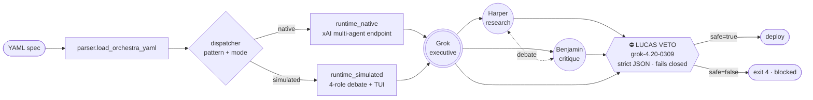

<!-- NEON / CYBERPUNK REPO TEMPLATE · GROK AGENT ORCHESTRA -->

<p align="center">
  
</p>

<h1 align="center">⚡ Grok Agent Orchestra</h1>

<p align="center">
  <b>Multi-agent YAML with a mandatory safety veto.</b><br/>
  Four named Grok roles debate. Lucas decides what ships. If the gate says no, nothing deploys.
</p>

<p align="center">
  
</p>

<p align="center">
  
  
  
  
  
</p>

---

## ✦ What This Is

Grok Agent Orchestra turns one YAML file into a Grok 4.20 multi-agent run with a mandatory safety veto at the exit. Four named roles — Grok (executive), Harper (research), Benjamin (critique), and Lucas (veto) — debate, and Lucas has the final word. Every deploy, every post, every webhook call passes through a fail-closed JSON gate running on `grok-4.20-0309`. Veto → exit code 4. No deploy.

Two execution modes from the same spec: **native** (xAI's `grok-4.20-multi-agent-0309` endpoint, 4 or 16 agents) or **simulated** (visible per-role debate, streamed through a Rich live TUI you can actually watch).

## ✦ Signature Stack

<p align="center">
  
  
  
  
  
  
  
</p>

## ✦ Why You'd Use It

<table>
  <tr>
    <td width="33%">
      <h3>🧠 Auditable Debate</h3>
      <p>Four named roles, full transcripts, per-role tool routing. Not a black-box ensemble.</p>
    </td>
    <td width="33%">
      <h3>🛡️ Fail-Closed Gate</h3>
      <p>Lucas runs strict-JSON safety review. Malformed, timeout, low confidence → blocks deploy.</p>
    </td>
    <td width="33%">
      <h3>⚙️ Two Modes · One Spec</h3>
      <p>Native xAI endpoint (4/16 agents) OR simulated debate. Same YAML. Swap with one line.</p>
    </td>
  </tr>
</table>

## ✦ 30 Seconds to a Dry Run

```bash
pip install grok-agent-orchestra   # pending — use `pip install -e .` from source for now
grok-orchestra init orchestra-native-4 --out my-spec.yaml
grok-orchestra run my-spec.yaml --dry-run
```

No xAI tokens needed for `--dry-run`. Canned-stream replay clients keyed on prompt shape make every pattern previewable offline.

## ✦ Architecture



Five orchestration patterns compose on top: `hierarchical`, `dynamic-spawn`, `debate-loop`, `parallel-tools`, `recovery`. Each ≤120 LOC. Each ends at Lucas.

## ✦ The Lucas Veto

The thing that makes Orchestra different from every other agent framework.

- Runs on `grok-4.20-0309` with **high reasoning effort**
- Enforces **strict JSON output** via schema + regex fallback parser
- **Fails closed** on malformed output, low confidence, or timeout
- Two separate veto passes in the combined runtime (mid-debate + pre-deploy)
- Exit codes: `0` success · `2` CLI error · `3` parse fail · `4` **veto** · `5` runtime fail
- Rich panel output: green ✅ for safe, red ⛔ for blocked

```yaml
# my-spec.yaml — minimal native run with veto
mode: native
pattern: hierarchical
model: grok-4.20-multi-agent-0309
agents: 4
task: "Draft a technical thread on the ΔS-1 migration."
veto:
  model: grok-4.20-0309
  effort: high
  fail_closed: true
```

## ✦ CLI

Eight commands, all Typer, all with typed exit codes.

| Command | Purpose |
|---|---|
| `init <template>` | Scaffold a YAML spec from 10 certified templates |
| `run <spec>` | Execute orchestra (supports `--dry-run`) |
| `validate <spec>` | Schema-check without executing |
| `templates` | List available templates with descriptions |
| `debate <spec>` | Stream the debate only — no deploy, veto advisory |
| `veto <text>` | Run Lucas veto standalone on arbitrary text |
| `combined <spec>` | Bridge codegen → Orchestra debate → veto → deploy |
| `version` | Print the installed Orchestra version |

## ✦ Orchestration Patterns

<table>
  <tr>
    <td width="50%">
      <h3>🎯 Hierarchical</h3>
      <p>Grok delegates to Harper + Benjamin; synthesis before veto.</p>
    </td>
    <td width="50%">
      <h3>🚀 Dynamic-Spawn</h3>
      <p><code>asyncio.gather</code> fan-out across N agents; veto aggregates.</p>
    </td>
  </tr>
  <tr>
    <td>
      <h3>🔄 Debate-Loop</h3>
      <p>Harper ↔ Benjamin iterate with mid-loop veto + consensus check.</p>
    </td>
    <td>
      <h3>⚡ Parallel-Tools</h3>
      <p>Union tool allowlist with post-stream audit before veto.</p>
    </td>
  </tr>
  <tr>
    <td>
      <h3>🛟 Recovery</h3>
      <p>Rate-limit / timeout wrapper with <code>fallback_model</code>; veto on final output.</p>
    </td>
    <td>
      <h3>🧩 Combined</h3>
      <p>Bridge codegen + Orchestra debate + Lucas veto in one Rich Live panel.</p>
    </td>
  </tr>
</table>

## ✦ Install from Source

```bash
git clone https://github.com/agentmindcloud/grok-agent-orchestra.git
cd grok-agent-orchestra
pip install -e ".[dev]"
grok-orchestra version
```

Requires Python 3.10 / 3.11 / 3.12. CI matrix covers all three with ≥85% coverage enforcement.

## ✦ Sibling Tools

<table>
  <tr>
    <td width="33%">
      <h3>🌉 grok-build-bridge</h3>
      <p>Codegen layer. Compose via <code>grok-orchestra combined</code>.</p>
      <a href="https://github.com/agentmindcloud/grok-build-bridge">Repository →</a>
    </td>
    <td width="33%">
      <h3>📦 grok-install</h3>
      <p>Declarative spawn manifest standard for Grok agents.</p>
      <a href="https://github.com/agentmindcloud/grok-install">Repository →</a>
    </td>
    <td width="33%">
      <h3>🌐 universal-spawn</h3>
      <p>Cross-platform spawn standard (Apache 2.0).</p>
      <a href="https://github.com/agentmindcloud/universal-spawn">Repository →</a>
    </td>
  </tr>
</table>

## ✦ Connect

<p align="center">
  <a href="https://github.com/agentmindcloud">
    
  </a>
  <a href="https://x.com/JanSol0s">
    
  </a>
  <a href="https://www.jansolos.com">
    
  </a>
</p>

## ✦ License

Apache 2.0. Use it, fork it, ship it. Lucas still has to sign off.

<p align="center">
  
</p>
