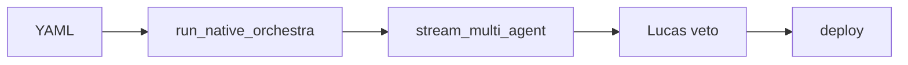
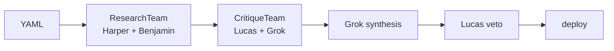
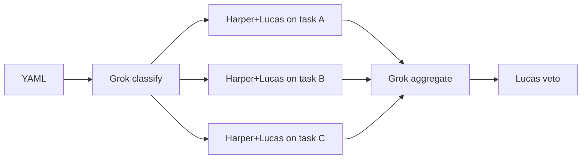
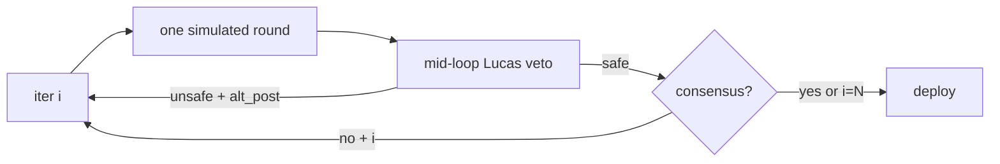
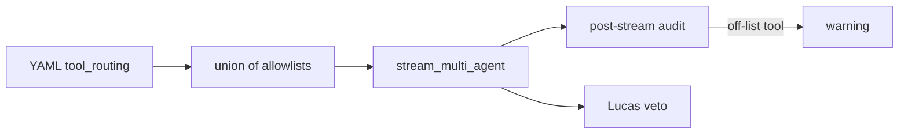

# Grok Agent Orchestra

[](https://github.com/agentmindcloud/grok-agent-orchestra/actions/workflows/ci.yml)
[](https://pypi.org/project/grok-agent-orchestra/)
[](#quick-start)
[](LICENSE)
[](docs/orchestra.md#lucas-veto)

<p align="center">
  
</p>

**The missing multi-agent layer for Grok 4.20 on X.**

One YAML drives either the xAI-native `grok-4.20-multi-agent-0309`
model or a visible prompt-simulated debate between Grok / Harper /
Benjamin / Lucas — with a real safety veto before anything ships.
Apache-2.0, 100% additive to the official `xai-sdk`.

---

## Why Orchestra exists

- **Native Grok 4.20 multi-agent is a primitive, not a product.**
  Orchestra wraps the endpoint in a live Rich TUI, an auditable
  event vocabulary, and sensible defaults so 4- or 16-agent runs are
  one `grok-orchestra run` away.
- **A visible debate is worth a dozen chain-of-thoughts.** The
  simulated mode exposes every system prompt, every role turn, and
  every tool call — you can watch Grok / Harper / Benjamin / Lucas
  disagree and resolve in real time, which makes the output
  defensible in a way a single opaque call never is.
- **Posting to X without a safety gate is a bad idea.** Lucas's veto
  (`grok-4.20-0309` at high reasoning effort, strict JSON output,
  fails closed on malformed responses) is baked in and on by default.

---

## 60-second Quick Start

```bash
# 1. Install
pip install grok-agent-orchestra

# 2. Scaffold a spec
grok-orchestra init orchestra-native-4 --out my-spec.yaml

# 3. Preview the debate (no API calls)
grok-orchestra run my-spec.yaml --dry-run
```

You'll see the branded banner, a live Rich debate TUI, a green
Lucas-approval panel, and the final post in a bordered summary. The
whole run is scripted — no xAI tokens burned.

Ready for the real thing?

```bash
export XAI_API_KEY=sk-xai-…
grok-orchestra run my-spec.yaml
```

---

## Two modes, one YAML

| aspect                | `mode: native`                         | `mode: simulated`                             |
|-----------------------|----------------------------------------|-----------------------------------------------|
| Model                 | `grok-4.20-multi-agent-0309`           | `grok-4.20-0309` single-agent                 |
| Agents                | 4 or 16, server-side routing           | Grok / Harper / Benjamin / Lucas, visible     |
| Visibility            | Aggregated stream                       | Every system prompt + every role turn         |
| Relative cost         | baseline (4a) / ~4× (16a)              | ~1× native-4, linear in `debate_rounds`       |
| Best for              | Production, high-stakes ships          | Audits, playgrounds, debugging, demos         |
| Tool routing          | Top-level `required_tools`             | Per-role via `tool_routing`                   |
| Latency               | One long call                           | Round-by-round turns (streams live)           |

`mode: auto` picks `native` when `agent_count` is set and
`include_verbose_streaming: true`; otherwise `simulated`.

---

## Five orchestration patterns

Each pattern is a composable flow on top of the same two runtimes.
Every one ≤120 LOC, every one has a turnkey bundled template, every
one runs in `--dry-run` without an API call.

### `native` — one-pass debate



### `hierarchical` — research → critique → synthesis



### `dynamic-spawn` — parallel fan-out



### `debate-loop` — iterate to consensus



### `parallel-tools` — native + per-agent tool routing



And `recovery` wraps any of the above: on `RateLimitError` /
`ToolExecutionError` / `TimeoutError`, lowers effort + optional
`fallback_model` swap, retries once, zero overhead on the happy path.

Deep dive: [`docs/orchestra.md`](docs/orchestra.md).

---

## The Lucas veto — Orchestra's hero safety feature

Every runtime ends with a Lucas review. One model, one effort, hard
coded. Strict JSON output. Fails closed.

### ✅ Approved — a benign post

```
╭────────── Lucas — safety verdict ──────────╮
│ ✅  Lucas approves                         │
│ confidence: 0.92                           │
│ notes:                                     │
│   · No harmful language or bias detected.  │
╰────────────────────────────────────────────╯
```

Raw verdict JSON:

```json
{"safe": true, "confidence": 0.92,
 "reasons": ["No harmful language or bias detected."],
 "alternative_post": null}
```

### ⛔ Vetoed — content that targets a group

```
╭────────── Lucas — safety verdict ──────────╮
│ ⛔  Lucas vetoes                           │
│ confidence: 0.94                           │
│ reasons:                                   │
│   · Targets a protected group.             │
│   · Likely to incite harassment.           │
│                                            │
│  ╭── Lucas's suggested rewrite ──╮         │
│  │  Reframe: here is a respectful… │       │
│  ╰────────────────────────────────╯        │
╰────────────────────────────────────────────╯
```

Raw verdict JSON:

```json
{"safe": false, "confidence": 0.94,
 "reasons": ["Targets a protected group.",
             "Likely to incite harassment."],
 "alternative_post": "Reframe: here is a respectful, evidence-based take…"}
```

Deploy is blocked. The CLI exits `4`. With
`safety.max_veto_retries > 0` the runtime retries the veto once with
the rewrite as the new `final_content` before giving up.

---

## Templates

Ten certified starters ship with the package. Browse them:

```bash
grok-orchestra templates           # Rich table
grok-orchestra --json templates    # machine-readable
```

| slug                                        | mode       | pattern          | combined | cost  |
|---------------------------------------------|------------|------------------|:--------:|------:|
| `orchestra-native-4`                        | native     | native           | —        |  ~8k  |
| `orchestra-native-16`                       | native     | native           | —        | ~32k  |
| `orchestra-simulated-truthseeker`           | simulated  | native           | —        | ~13k  |
| `orchestra-hierarchical-research`           | simulated  | hierarchical     | —        | ~22k  |
| `orchestra-dynamic-spawn-trend-analyzer`    | simulated  | dynamic-spawn    | —        | ~15k  |
| `orchestra-debate-loop-policy`              | simulated  | debate-loop      | —        | ~25k  |
| `orchestra-parallel-tools-fact-check`       | native     | parallel-tools   | —        |  ~9k  |
| `orchestra-recovery-resilient`              | native     | recovery         | —        | ~35k  |
| `combined-trendseeker`                      | simulated  | native           | ●        | ~50k  |
| `combined-coder-critic`                     | simulated  | native           | ●        | ~55k  |

The machine-readable catalog with tags + marketplace badges is at
[`grok_orchestra/templates/INDEX.yaml`](grok_orchestra/templates/INDEX.yaml).

---

## Combined with Bridge

One YAML. Bridge generates code. Orchestra debates it. Lucas vetoes.
Deploy.

```yaml
# combined-trendseeker.yaml
combined: true

build:
  name: trendseeker
  target: python
  files:
    - path: trendseeker/__init__.py
      template: |
        from .scraper import top_topic
        __all__ = ["top_topic"]

orchestra:
  mode: simulated
  debate_rounds: 1
  orchestration: {pattern: native}
  agents:
    - {name: Grok,     role: coordinator}
    - {name: Harper,   role: researcher}
    - {name: Benjamin, role: logician}
    - {name: Lucas,    role: contrarian}

safety:
  lucas_veto_enabled: true
  confidence_threshold: 0.80

deploy:
  target: stdout
  post_to_x: false
```

Run it:

```bash
grok-orchestra combined combined-trendseeker.yaml --dry-run
```

All six phases render inside **one** live panel — `📄 parse →
🎯 Bridge → 🎤 Orchestra → 🛡 Lucas → 🚀 deploy → ✅ done` — no
teardown flicker between stages.

---

## xAI alignment

- **Apache 2.0.** No rug-pull. Fork, modify, ship.
- **Uses the official `xai-sdk`.** No forked clients, no scraped
  endpoints.
- **Targets `grok-4.20-multi-agent-0309` verbatim** for native runs.
- **100% additive.** Orchestra is a thin orchestration layer on top
  of Grok Build Bridge's `XAIClient` — it never replaces or shadows
  xAI's own APIs.

---

## Roadmap

- `v0.2.0` — custom personas in the marketplace, Rich TUI
  screenshots to SVG/GIF out of the box, `orchestra.metrics` hook
  for per-run cost reporting.
- `v0.3.0` — multi-spec batch runs, deterministic re-play from
  captured event streams, first-class support for X thread posting
  with per-tweet gating.

See issues tagged `roadmap` for the detail.

## Contributing

PRs welcome. Read [`SECURITY.md`](SECURITY.md) before filing
anything that touches the veto or the combined runtime. Run the
full suite locally with `pytest --cov=grok_orchestra` — CI enforces
≥85% coverage and `ruff check .` clean.

- [`docs/orchestra.md`](docs/orchestra.md) — full YAML reference + pattern internals.
- [`docs/vscode-orchestra.md`](docs/vscode-orchestra.md) — IntelliSense for Orchestra YAMLs.
- [`docs/playground.md`](docs/playground.md) — SSE adapter for the browser playground.
- [`docs/marketplace-v2.md`](docs/marketplace-v2.md) — badge + discovery spec.

## License

Apache 2.0. Copyright (c) 2026 Jan Solo / AgentMindCloud.
See [LICENSE](LICENSE).

## Credits

- **Grok 4.20** multi-agent endpoint and `xai-sdk` — xAI.
- **Grok Build Bridge** — the single-agent Bridge Orchestra extends.
- The community for every early-run screenshot, every spec-bug
  report, and every quote-retweet.
